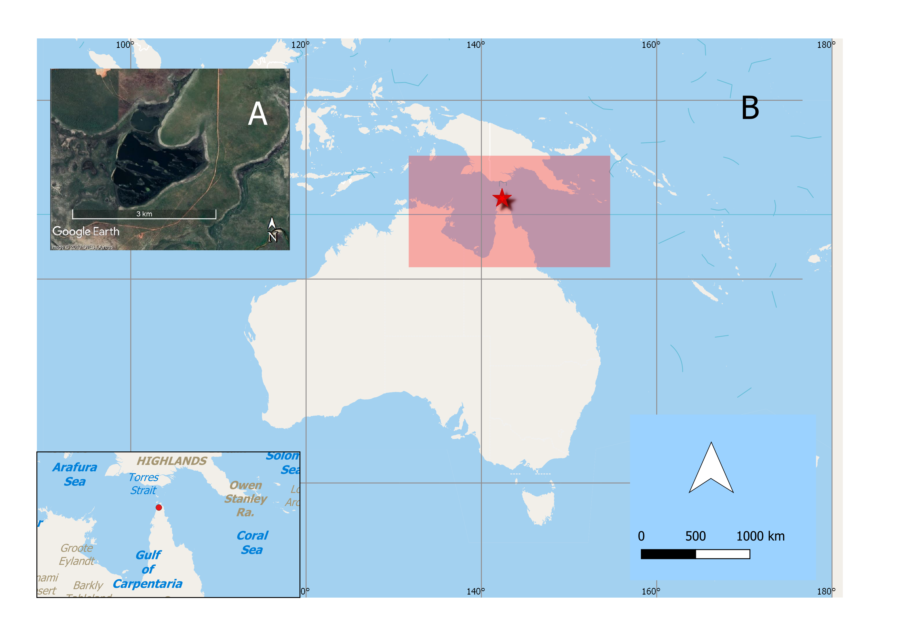
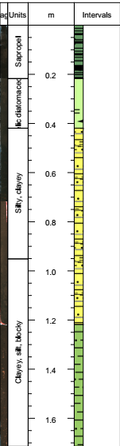
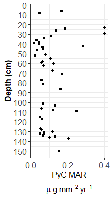
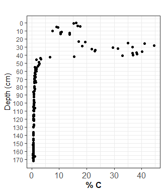
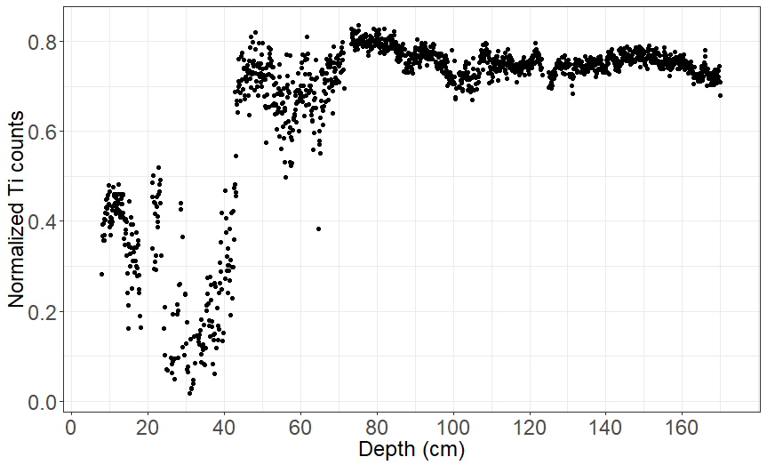

---
output:
  pdf_document: default
  html_document: default
editor_options: 
  chunk_output_type: console
---

# The radiocarbon dates of different organic fractions from a tropical lake sediment core in the savannas of tropical Australia: A case study from Sanamere Lagoon, northeast Australia {#ch:radiocarbon}

```{r radiocarbon, echo = FALSE, cache = FALSE, include = FALSE}
library(knitr)
library(here)
library(bookdown)
read_chunk('C:/Users/Maria Jose Rivera/OneDrive - James Cook University/Australia renamed/Sanamere/Thesis sections/PhD-thesis-VC/analysis/Radiocarbon/an_radiocarbon-LAPTOP-3NCFQGAR.R')
#read_chunk((here("analysis", "Radiocarbon", "an_radiocarbon-LAPTOP-3NCFQGAR.R")))
#setwd("C:/Users/Maria Jose Rivera/OneDrive - James Cook University/Australia renamed/Sanamere/Thesis sections/PhD-thesis-VC/writeup")
###not know why if EVAL=TRUE in chunk with ggplot knitting to word does not work

```

```{r load-pkg,echo = FALSE, cache = FALSE, include = FALSE}
```

## Introduction

Obtaining accurate chronologies is fundamental to achieve reliable paleoenvironmental reconstructions. Selecting a reliable carbon fraction and a pre-treatment that removes all or most of the contaminants are key in the radiocarbon dating process. This selection becomes particularly challenging in the tropics, given the hot and moist conditions that negatively influence the preservation of different organic fractions [@birdRadiocarbonAnalysisEarly2002; @highamRadiocarbonDatingCharcoal2009]. Also, the hydrological seasonal cycles and high annual temperatures in tropical environments cause high rates of weathering and variable pH and redox conditions, which alters the carbon cycling and preservation in the lake sediment column. These conditions limit the availability of those fractions considered more reliable and cause aberrant radiocarbon results that are linked with poorly preserved or degraded charcoal, such as when the combustion yields are lower than usually expected (50–60 % C by weight) [@highamRadiocarbonDatingCharcoal2009]. Although there is currently no agreement about which is the most reliable fraction to avoid these issues, short-lived plant macrofossils and charcoal [@cohenPaleolimnologyHistoryEvolution2003;@martinRadiocarbonAgesDifferent2019] are preferred along different fractions. 

Despite the importance of choosing a reliable carbon fraction that represents the age of surface sediment deposition, no previous study has compared the ages of several carbon fractions in tropical lake sediments. Comparative studies between organic fractions in the tropics have focused in swamps [@mayEstablishingChronologicalFramework2018], peats [@wustComparisonRadiocarbonAges2008] and organic springs [@fieldUntanglingGeochronologicalComplexity2018], with no studies performed in lake sediments and comparing more than four fractions. Results from these studies are contradictory regarding the reliability of macro-charcoal and pollen concentrates (yielding anomalously older or younger ages compared to other fractions). Previous studies (mostly in temperate areas) have also reported significant discrepancies between dates for different carbon fractions in lake sediments from the same depth. For example, in boreal and arctic lake sediments wood and charcoal were found to be older than other macrofossil types, usually by several hundred years [@oswaldEffectsSampleMass2005]. Discrepancies have been found also within different types of macrofossils, with some of them more prone to an apparent ‘reservoir effect’ [@turneyImplicationsDatingWisconsinan2000]. For instance, pollen, charcoal and bulk sediment are recognized to be highly mobile, porous and heterogeneously sourced, which complicates their reliability for radiocarbon dating. Additionally, several studies have demonstrated that there are significant uncertainties associated with dating bulk sediment [@bjorckHighresolution14CDated1998; @wustComparisonRadiocarbonAges2008; @xuVariationsRadiocarbonAges2003]. 

Extensive research has also shown how the effect of contamination depends on the age of the sample. Dating beyond 10 k cal BP becomes considerably problematic as even minimum percentages of contamination would cause thousands of years of offset [@aitkenSciencebasedDatingArchaeology1990 ; @woodRevolutionConventionPresent2015]. In fact, offsets of up to 16,000 years between radiocarbon ages from bark and pollen from a tropical peat were obtained in a previous study [@wustComparisonRadiocarbonAges2008]. 

The pre-treatment procedure is also fundamental in the radiocarbon dating process. While the acid-base-acid  (ABA) is the routine pre-treatment to remove contaminants, it is not always effective to do so [@chappellRadiocarbonLimitAustralian1996; @gillespieAMSDatingLate1992], and the determination of how and when it does it is technically challenging and highly uncertain. The base treatment during ABA can also remove charcoal while oxidizing it to humic acid, with the subsequent sample loss. As an alternative to ABA, ABOX has been found to be the most appropriate and effective method to remove contamination, especially for old samples [@birdRadiocarbonDatingOld1999; @birdEfficiencyCharcoalDecontamination2014], but its harshness compromises their preservation, and therefore its application in the tropics. Hydropyrolysis (hypy) (to isolate stable polycyclic aromatic carbon (SPAC)) has shown promising results in mound spring deposits, where it appeared to remove the effects of post-depositional modification in the ages of the sediment [@fieldUntanglingGeochronologicalComplexity2018], and its behavior is expected to be similarly effective in lake sediments.

Given the fact that most studies rely on the dates from one organic fraction over the entire sequence, based on chronological consistency (but not necessarily accuracy), it is imperative to test whether an alternative protocol that involves carbon fraction, pre-treatment and potential age) would yield more accurate results. 

## Methodology

Sanamere Lagoon (11.123030 S 142.359470 E; 15 m asl) is located close to the northern tip of Cape York Peninsula. The lagoon is 1 km north of the W-E flowing perennial Jardine River (Figure \@ref(fig:radiocarbon1)). The climate of the region is monsoonal with 88 % of the annual 1753 mm rainfall falling between December and April with a mean annual temperature of 27 C. The vegetation that surrounds the lagoon is composed by heathlands. 

Using a hydraulic rig, we recovered four sequential sediment cores (1.72 m in total) from the deepest portion of the lagoon in July 2017 from one coring site within the lake. The location was chosen based in previous reconnaissance work done in May and April 2016. Evidence from satellite observations suggest that the lagoon does not dry during the dry season.

The four sequential sediment cores were described according to standard description terms [@schnurrenbergerClassificationLacustrineSediments2003] and photographed on the ITRAX micro X-ray Fluorescence (uXRF) core scanner at the Australian Nuclear Science and Technology Organisation (ANSTO). 

Carbon-14 dates were obtained for six different carbon fractions (SPAC, microcharcoal, macrocharcoal, pollen concentrate, cellulose and bulk organics) for six depths spread along the core (Table \@ref(tab:tb-one), with no macrofossils found. Although attempts to extract all fractions from the same depth were made, this was not achieved given that some of them yielded insufficient amounts of carbon to be processed for radiocarbon dating. 

Pre-treatment of radiocarbon samples for pollen, macrocharcoal and microcharcoal and bulk organics (standard method) followed the standard ANSTO protocols detailed below. Samples were combusted at 900 C to convert them to CO2, followed by graphitisation using the H2/Fe method [@huaProgressRadiocarbonTarget2001]. Carbon-14 measurement of all samples was undertaken by Accelerator Mass Spectrometry (AMS) on the VEGA and ANTARES accelerators at ANSTO [@finkANTARESAMSFacility2004] except for samples Wk50327 and Wk50328, which were measured at the Waikato Radiocarbon Dating Laboratory.

### Pollen

Three sediment samples were washed with 10 % HCl and then passed through a 150 um sieve. The smaller fraction was retained and then washed with 10 % NaOH several times until the supernatant was clear. Subsequently, 40 % HF was added and left overnight. Lithium heteropolytungstate (LST) with a specific gravity of 1.8 was used for density separation, and the floating fraction was retained and analysed under the microscope.

### Bulk organics (standard)

Five sediment samples were processed following the standard ABA pre-treatment. First, visible contaminants (roots, rocks) were removed and then a wash with 2 M HCl was performed, followed by sequential washes of 0.5 %, 1 %, 2 % and 4 % NaOH, until the supernatant liquid was clear.

### Bulk organics (modified)

Additionally, two sediment samples were first pretreated with 30 % hydrogen peroxide overnight, freeze dried and then sent for standard ABA pre-treatment to the Waikato Radiocarbon Dating Laboratory.

### Macro and microcharcoal

Samples OZX765U1 and OZX765U2 were pre-treated with 30 % hydrogen peroxide for 2 h and then passed through 250 um and 63 um sieves. These two fractions were then examined under the microscope, and pieces of charcoal were recovered manually (in the case of the >250 um) and using a micromanipulator (for the >63 um fraction). Samples were then washed with 0.5 % NaOH and 2 M HCl. Samples OZY758 and OZY423 were pre-treated with 10 % hydrogen peroxide and the pre-treatment followed as above.

### Cellulose

Extraction of cellulose was adapted from Gillespie (2019) [@gillespieNovelCellulosepreparationMethod2019]. Three sediment samples were pre-treated with NaOCl/NaOH for 2 hours, washed with 1 M HCl, then left reacting with NaClO2/HCl for other 2 hours and then washed with 1 M HCl. This procedure was repeated a second time.

### SPAC

Fourteen sediment samples were pretreated using hydrogen pyrolysis following a modified procedure [@ascoughHydropyrolysisNewTool2009; @meredithAssessmentHydropyrolysisMethod2012]. First, 30 % hydrogen peroxide was added to the samples, these were left overnight and then washed with 2 M HCl, and freeze dried. Aliquots of each sample were then loaded with a catalyst and 20 % MeOH/H2O solution, sonicated for 15 min and dried over a hotplate at 60 C. These samples were placed in the HyPy reactor, pressurized with hydrogen (H2) to 150 bar with a gas flow of 4 L/minute over 40 minutes. Finally, samples were washed for 2 hours with 6 M HCl at 60 C. The pre-treated residues were combusted and graphitised as described before measured by AMS at ANSTO.

All samples were calibrated using the OxCal program (V 4.3.2) [@bronkramseyOxCalProgramRadiocarbon2010] and the Southern Hemisphere calibration curve (SHCal13) [@hoggSHCal13SouthernHemisphere2013], with 0 cal yr BP representing 1950 AD.

Following the discussion above, we aimed to compare 14C measurements on the mentioned carbon fractions isolated from sediment samples. The reliability of each fraction will be discussed according to their consistency with the expected age/depth model and their relationship with the other fractions. 

```{r radiocarbon1,out.width = '50%', fig.align = "center", fig.cap = "(ref:tsibble-fit-cap)",echo=FALSE}


```
(ref:tsibble-fit-cap) Location of Sanamere Lagoon in Cape York

```{r tb-one-pre,echo = FALSE, cache = FALSE, include = FALSE}
```

```{r tb-three,echo = FALSE, include = FALSE,warning=FALSE,cache=FALSE}
```

## Results


The sedimentary sequence for Sanamere Lagoon is shown in Figure \@ref(fig:lithology). The first 22 cm of the core consist of a black, organic (5 - 10 % C) layer. Between 22 cm and 43 cm the core changes to a black, well decomposed sapropelic diatomaceous layer (20 - 40 % C). From 43 cm, a marked decrease in organic content (0.5 to 1 %) is shown down-core whilst the clay and silt content increase. Starting at 122 cm the gravel content also increments, while the carbon content stays low. 

```{r lithology,out.width = '50%', fig.align = "center", fig.cap = "(ref:lithology)",echo=FALSE}


```
(ref:lithology) Stratigraphy and photographs of Sanamere 

A total of `r length(unique(all_first_table2$'Laboratory Code'))` radiocarbon dates were obtained for `r length(unique(all_first_table2$Depth))` different depths along the core. Ages were obtained for more than one fraction in six depths. Table \@ref(tab:tb-one) shows the results from the conventional radiocarbon dating measurements and the calibrated results. The oldest calibrated date is `r as.integer(max(data522$from_95,na.rm=TRUE))` and the youngest is `r as.integer(min(data522$to_95,na.rm=TRUE))`, spanning `r as.integer(as.integer(max(data522$from_95,na.rm=TRUE))-as.integer(min(data522$to_95,na.rm=TRUE)))` years. After 82 cm, the availability of fractions to compare was reduced to bulk organics, SPAC and pollen concentrate, as these were the only ones that yielded enough carbon to be analysed by AMS. Therefore, charcoal fractions > 63 um and cellulose could not be compared after this depth.From the 3 depths that were originally pretreated with the cellulose pre-treatment method only one yielded enough carbon to be measured, given the harshness and aggressiveness of the pretreatment. Except for the micro-charcoal at 3 cm and the SPAC ages at 90 and 105 cm, no age reversals were found in the sequence. 
The offset between the ages from different fractions generally increased with depth (Table \@ref(tab:tb-four)). The only section of the core where dating results overlap (except for the pollen concentrate) is at 6 cm, while the other five depths showed large differences between the results from different fractions, with the largest offset at 146 cm (16,527 yrs), between SPAC and pollen. The bulk organics fractions pretreated with standard ABA procedures also differed largerly from the SPAC fraction (up to `r max(ff3[which(ff3$"Carbon fraction (min)"=="Bulk organics" & ff3$"Carbon fraction (max)"=="SPAC"),6])`). Although not from the same depths (but close to), the modified ABA pretreatment yielded results that aligned closer to the ones with SPAC/Hypy.

In 4 out of 6 cases (the deepest samples), SPAC yielded the oldest date from the correspondent depth, and in 2 cases (the shallowest samples), SPAC yielded the youngest results. Bulk organics (standard ABA) yielded the youngest result for four depths (43, 67, 137 and 146 cm). Pollen and charcoal (> 63 um) yielded inconsistent results. In the case of the former, at 6 cm, the oldest result from fractions at the same depth was obtained and the youngest at 146 cm. The three charcoal results between 3 cm and 82 cm suggest an age reversal. The only cellulose sample yielded a younger date in comparison to what was expected.

```{r tb-one,echo = FALSE, eval=TRUE, include = TRUE,warning=FALSE}

```
(ref:tb-one) Conventional and calibrated dates from all samples tested in the study

```{r tb-four,echo = FALSE, eval=TRUE, include = TRUE,warning=FALSE}

```
(ref:tb-four) Offset, minimumm and maximum calibrates ages per depth

```{r radiocarbon-gr1, echo = FALSE, eval=TRUE, include = TRUE,warning=FALSE,fig.cap = "(ref:radiocarbon-gr1)",out.width = '60%', fig.align = "center"}
```

(ref:radiocarbon-gr1) Calibrated dates per depth and carbon fraction along the Sanamere sediment core

## Discussion

Large differences between the radiocarbon ages of different fractions at the same or comparable depths (except at 6 cm) were found. These differences make the case for the presence of either modern or fossil contamination in some of the fractions. For example, the largest offset between two fractions was found at 146 cm between pollen and SPAC, which suggests that pollen from higher depths mobilized down the core and/or the concentrate contained exogenous materials. The two pollen concentrate samples show inconsistent results, as found in previous studies (younger [@fieldUntanglingGeochronologicalComplexity2018; @mayEstablishingChronologicalFramework2018 ] or older  [@neuliebPotentialPitfallsPollen2013; @fletcherAMSRadiocarbonDating2017], with the one at 6 cm having the oldest date compared with the other fractions at the same depth, while the one at 146 cm the youngest compared to the bulk organics and SPAC results. When inspected under the microscope, these samples appeared to be composed by around 50 % pollen, with the rest of material being plant material and charcoal. This addition of heterogeneously sourced materials could have added young carbon with the result of abnormally younger radiocarbon results. Other studies have identified anomalously young ages derived from pollen concentrates [@mayEstablishingChronologicalFramework2018; @clymoUpwashDownwashPollen1987] due to the high mobility but also the high porosity of its walls, which can store exogenous carbon [@kilianProblematic14CAMSDates2002a]. 

Large offsets (up to 9,516 cal BP years) were also found between bulk organics and SPAC, with the former showing younger ages. This finding is consistent with previous studies which found that bulk organics pretreated with standard ABA yielded young dates, and are considered to result in younger ages than the true ages of soils [@wangRadiocarbonDatingSoil1996; @wustComparisonRadiocarbonAges2008; @pessendaRadiocarbonDatingTotal2001]. Although measured at 42 cm (not 43 cmas the other two fractions), the cellulose extraction yielded an age younger compared to what was expected from the bulk organics and SPAC age-depth relationship. 

While the results from micro and macro charcoal were expected to be tested along the core to better understand differences in their sources, their availability was limited after 82 cm.  As the age ranges obtained for both overlapped at 6 cm, the possibility that they represent different sources is low. The charcoal samples (>63 um) at 3 cm and 82 cm showed older and younger dates (respectively), compared to the age/depth relationships expected with the modified bulk organics and SPAC. It is possible that the incomplete removal of organic contaminants by the standard ABA method caused this offset. Given its large surface area and porosity, charcoal is known for absorbing exogenous carbon, which can undergo irreversible reactions with the charcoal surface. Charcoal is also suitable for microbial colonization, which cycling of carbon could incorporate exogenous carbon. Iron carbonate (siderite) and oxides of different cations may also be formed during pedogenesis. If failed to be removed, this carbon can introduce large age differences with measured younger dates [@birdRadiocarbonAnalysisEarly2002; @birdCharcoal2007].

The SPAC dates at 23 and 32 cm show an age reversal, which is coindident with the section of the core that has high organic content, pyrogenic carbon mass accumulation rates and high fluctuations in the normalized titanium counts (range 0.02 - 0.45) (Appendix, Figure \@ref(fig:appendix1), Figure \@ref(fig:appendix2), Figure \@ref(fig:appendix3)). Both, changes in erosion and high organic input during this period suggest that some reworking could have happened during this period, which coincides with the flooding of the continental shelf and the increase in sea level during the early Holocene in north Australia [@chivasSealevelEnvironmentalChanges2001; @yokoyamaShorelineReconstructionAustralia2001; @reevesPalaeoenvironmentalChangeTropical2013]. A second age reversal is present at 90 cm and 105 cm in the SPAC results, with the only apparent change being a slight decrease in the titanium counts down-core between these two depths. It is possible that the date at 105 cm exhibits an incomplete removal of exogenous carbon, the main issue identified when applying hypy pre-treatment.

All ages returned from SPAC (except at 6 cm) following hypy pre-treatment are considerably older than comparable dates from other carbon fractions. This finding is consistent with the results obtained from the radiocarbon dates from organic spring deposits in northwest Australia, where SPAC ages were found to be older than other fractions, but also more reliable given their consistency within each core [@fieldUntanglingGeochronologicalComplexity2018]. In the present study, SPAC is also considered the most reliable fraction, despite the age reversals. Hypy, the pre-treatment used to isolate SPAC, reduces labile organic matter to volatile products [@ascoughHydropyrolysisNewTool2009] and potentially removes > 92 % of all labile carbon. SPAC represents the carbon fixed by pyrolysis at the time of a burning event, therefore the ‘indigenous’ component of the original charcoal [@ascoughHydropyrolysisNewTool2009; @ascoughHydropyrolysisImplicationsRadiocarbon2010]. 

Besides the possibility of reworking and mobility, it is likely that the differences between the ages of fractions at 43, 67, 137 and 146 cm are caused by modern contamination in the bulk organics (standard) and pollen fractions. These results suggest that the standard ABA pretreatment was ineffective in removing modern contamination from the bulk organics fraction. Although fossil contamination and inbuilt ages can alter the SPAC results, it is unlikely old carbon contamination cause such large offsets with other fractions. Given the chronological consistency obtained from the SPAC fractions and the percentage of fossil carbon and/or “old charcoal” in the pyrogenic carbon fractions that could cause such differences would be very high, which makes this possibility highly improbable. Strong evidence for this argument is the result from the two modified bulk organics samples, where peroxide was used before standard ABA, and the dates yielded close results to SPAC. The consistent increment of the offset in the ages between fractions agrees with the results from previous studies, which have found dates older than 10,000 yr BP the most problematic in terms of the effects of contamination. Moreover, the increasing magnitude of the difference between SPAC and the other fractions ages with depth/age is consistent with what would be expected for samples with between 2 and 5 % of modern carbon inclusion [@woodRevolutionConventionPresent2015]. Although the SPAC age at 6 cm represents the youngest interval of all fractions, this was likely caused by the pyrolysation of a small component of exogenous carbon that became fixed in the resultant pre-treated sample [@wursterQuantifyingAbundanceStable2012]. 


## Appendix {#sec:appendix}

```{r appendix1,out.width = '50%', fig.align = "center", fig.cap = "(ref:pyc)",echo=FALSE}


```
(ref:pyc) Pyrogenic carbon mass accumulation rate


```{r appendix2,out.width = '50%', fig.align = "center", fig.cap = "(ref:C)",echo=FALSE}


```
(ref:C) Carbon content

```{r appendix3,out.width = '50%', fig.align = "center", fig.cap = "(ref:Ti)",echo=FALSE}


```
(ref:Ti) Normalized titanium counts in the Sanamere core


